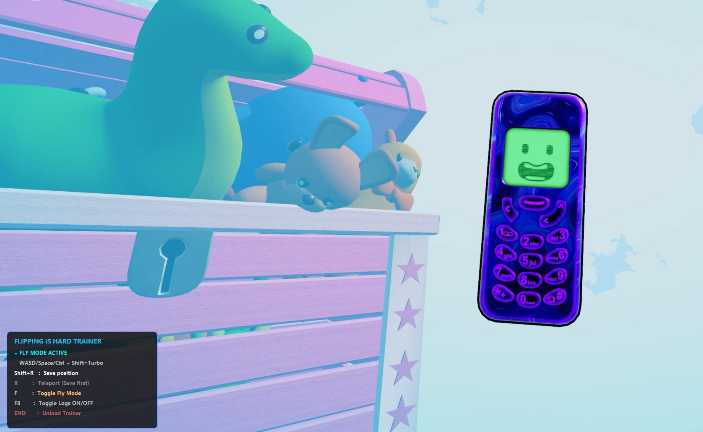

# Flipping is Hard - Practice Trainer

A Unity IL2CPP trainer for "Flipping is Hard Demo" that enables position saving/restoring and smooth fly mode for speedrun practice. Perfect for mastering difficult sections without restarting.

  

## ✨ Features
- **📌 Position Save/Restore** - Save any position with `Shift+R`, teleport back with `R`
- **✈️ Smooth Fly Mode** - Toggle free-camera flight with `F` key
  - Camera-relative movement with WASD (follows where you look)
  - Vertical movement with Space/Ctrl
  - Speed boost with Shift (3x faster)
  - No gravity - stay in the air indefinitely
  - Smooth, jitter-free movement
- **📍 Real-time Coordinates** - Functional HUD in the top-right corner showing current `HEIGHT` and `XYZ` position
- **🎮 Smart Overlay** - Real-time HUD showing controls, fly mode status, and saved position
  - **Only visible when game is in focus** - Automatically hides when you tab out
  - Bottom-left corner for controls
  - Top-right corner for coordinates

## 🚀 Quick Start

### 1. **Build the Trainer**
```bash
build.bat
```
This compiles both `trainer.dll` and `injector.exe` using Visual Studio 2022.

### 2. **Start the Game**
Launch "Flipping is Hard Demo.exe" and get into gameplay.

### 3. **Inject the Trainer**
```bash
injector.exe
```
The injector automatically finds the game process and loads the trainer.

### 4. **Use In-Game**
- **`Shift + R`** → Save current position & rotation
- **`R`** → Teleport to saved position (resets physics)
- **`F`** → Toggle Fly Mode ON/OFF
- **Fly Mode Controls:**
  - `W` / `S` → Move forward/backward (relative to camera)
  - `A` / `D` → Move left/right (relative to camera)
  - `Space` → Move up (world space)
  - `Ctrl` → Move down (world space)
  - **`Shift` (hold)** → Speed boost (3x faster)
- **`F8`** → Toggle logging (console only)
- **`END`** → Unload trainer

## 📁 Project Structure
```
Trainer/
├── trainer.cpp          # Main trainer DLL (IL2CPP hooks + overlay)
├── injector.cpp         # DLL injector (process injection)
├── build.bat            # Build script for Visual Studio
├── README.md            # This file
└── .gitignore           # Excludes compiled binaries
```

## 📋 Requirements
- **Windows 10/11** (x64)
- **Visual Studio 2022** (or any C++17 compiler)
- **Game**: "Flipping is Hard Demo" (Unity IL2CPP build)
- **Administrator rights** (for process injection)

## 🎮 Overlay Preview


The overlay appears in the bottom-left corner and top-right:

**Controls (Bottom-Left):**
```text
  FLIPPING IS HARD TRAINER
  » FLY MODE ACTIVE            (when fly mode is on)
     WASD/Space/Ctrl + Shift=Turbo
  Shift+R   :  Save position
  R         :  Teleport (Ready)
  F         :  Toggle Fly Mode
  END       :  Unload Trainer
```

**Coordinates (Top-Right):**
```text
  HEIGHT: 0.0 M
  XYZ: 0.0, 0.0, 0.0
```

## ⚠️ Notes & Limitations
- **Game Must Be Running** - Injector requires the game process to be active
- **Source Code** - 100% open source, no obfuscation
- **Overlay** - Only visible when the game window is in focus
- **END Key** - Unloading the trainer will close the game

## 🔧 Building from Source
1. Install Visual Studio 2022 with C++ development tools
2. Navigate to project folder
3. Run `build.bat` 

## 🤝 Contributing
Found a bug or have an improvement? Feel free to:
1. Fork the repository
2. Create a feature branch
3. Submit a pull request

## 📄 License
MIT License - See [LICENSE](LICENSE) file for details.

Free for personal, educational, and non-commercial use.

## 🙏 Credits
- **Game**: "Flipping is Hard" by [Elegant Horse Studios]
- **Development**: Assisted by AI
- **Testing**: Community feedback welcome!

---
**Disclaimer**: This tool is for educational purposes and single-player practice only. Use responsibly.